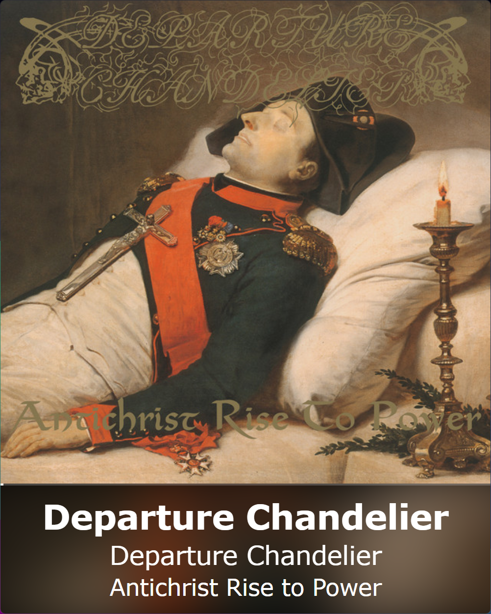
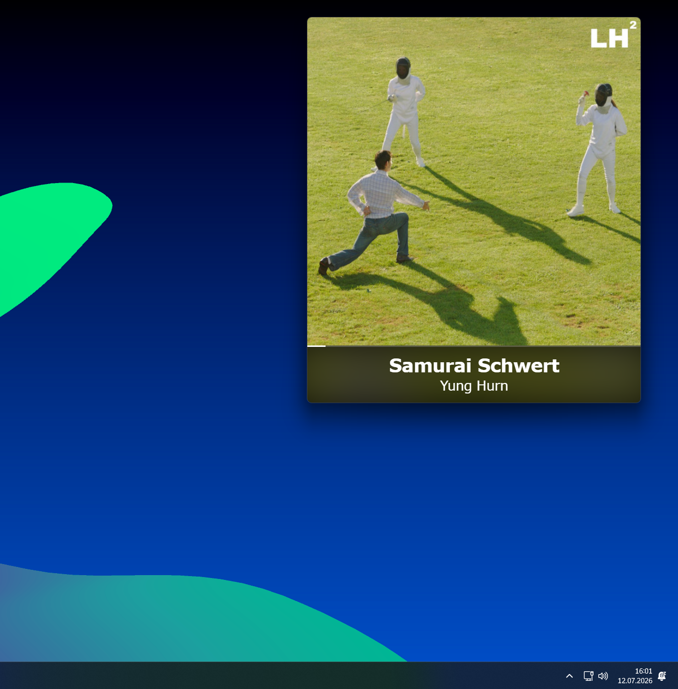
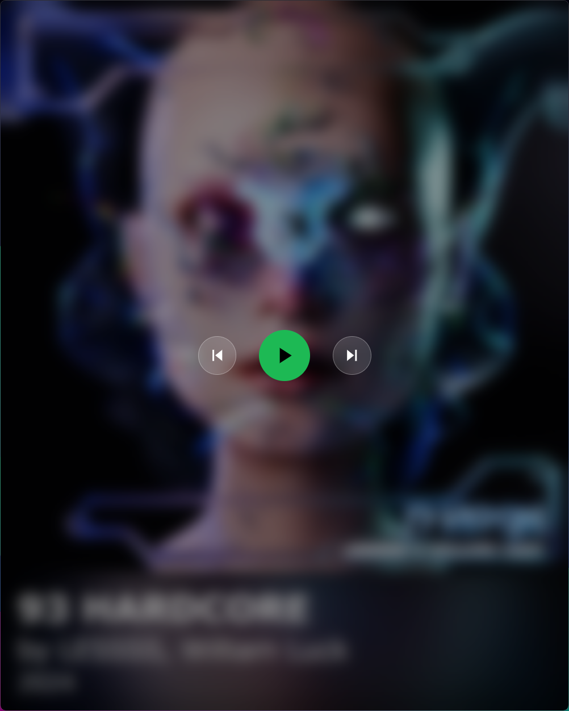
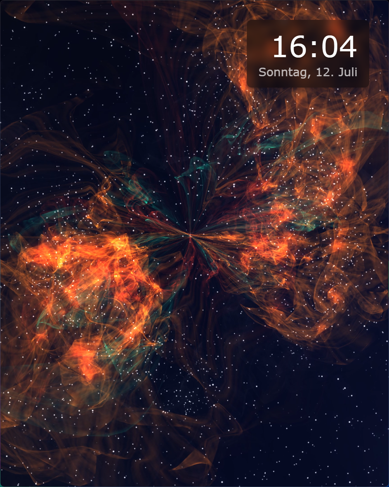
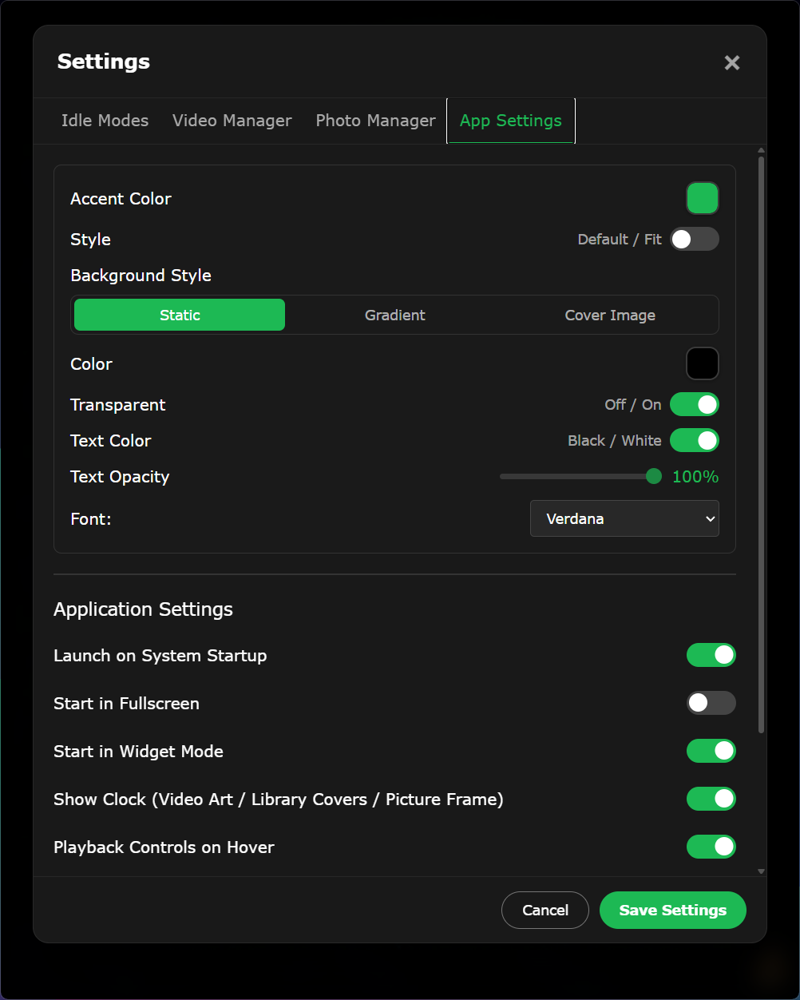
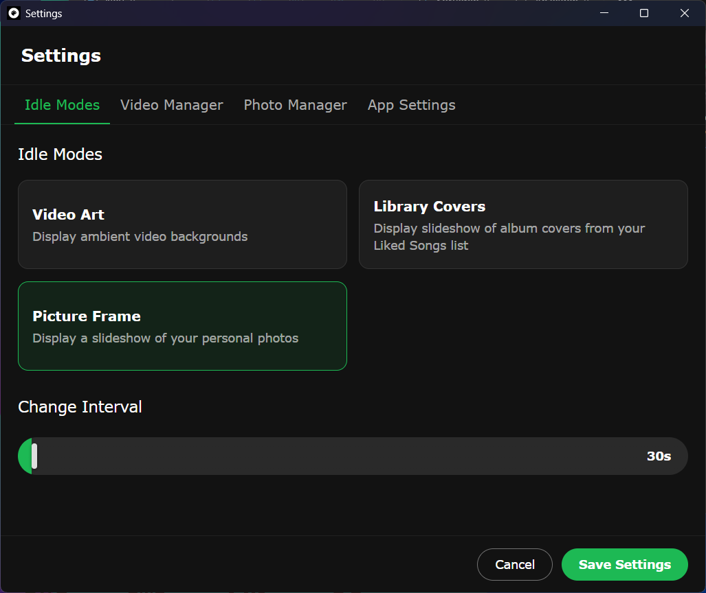
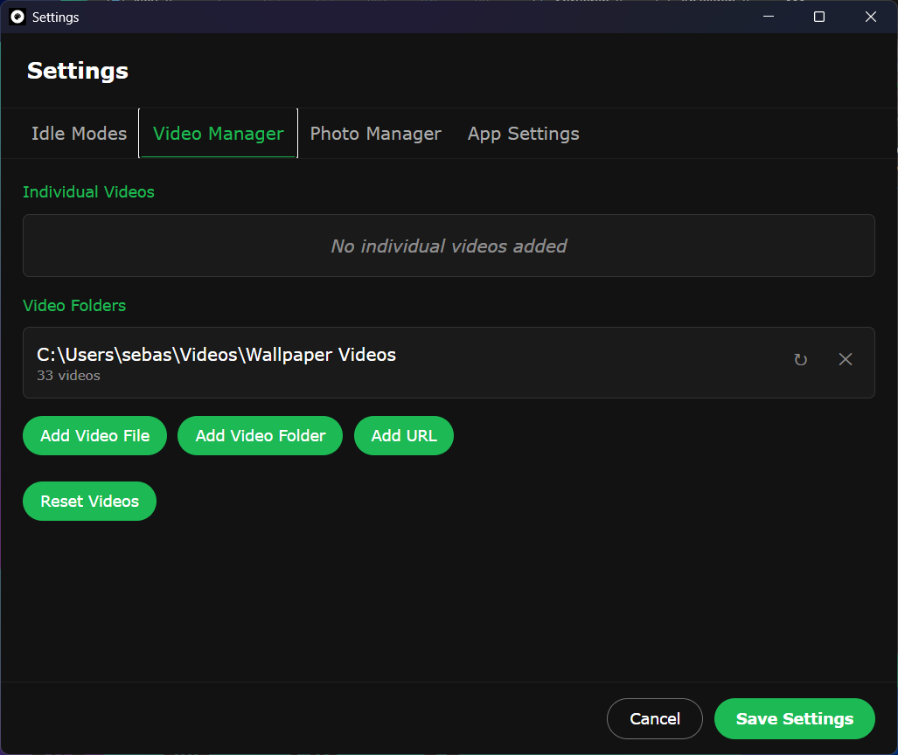
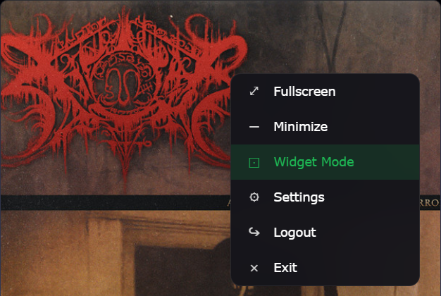

# Spotify Cover Art Display

[](https://github.com/sabsimilian/CoverArtDisplay/releases/latest)
[](LICENSE)


A desktop app that turns a screen into a live display of whatever's currently playing on Spotify — full album art, fullscreen or windowed, a small always-on-top widget mode, ambient idle-mode slideshows when nothing's playing, and hover-to-reveal playback controls.

Built with [Tauri v2](https://tauri.app/), [SvelteKit](https://kit.svelte.dev/) (Svelte 5), and [Tailwind CSS v4](https://tailwindcss.com/).

<p align="center">
  
</p>

## Contents

- [Features](#features)
- [Download](#download)
- [First-time setup](#first-time-setup)
- [Known issues](#known-issues)
- [Building from source](#building-from-source)
- [Tech stack](#tech-stack)
- [License](#license)

## Features

**Now Playing**
Full-bleed cover art with track/artist/album, long text scrolls once so it can be read in full, and a live progress bar tracking playback position.

**Widget Mode**
A small window for keeping the current cover art visible while doing other things — remembers its own size and position across restarts.

<p align="center">
  
</p>

**Playback Controls**
Hover over the cover art to darken/blur it and reveal Back / Play-Pause / Forward — works in Now Playing, every idle mode, and widget mode. Can be turned off entirely in settings.

<p align="center">
  
</p>

**Idle Modes**
When nothing's playing, the app doesn't just sit blank — pick one:
- **Video Art** — loops your own ambient video files/URLs as a background
- **Library Covers** — shuffles through album covers from your Liked Songs
- **Picture Frame** — slideshow of your own photos, with an optional black & white filter

An optional ambient clock can overlay any idle mode.

<p align="center">
  
</p>

**Deep customization**
Accent color, metadata background style (solid color / color extracted from the cover / the cover art itself, blurred and extended), transparency, text color and opacity, font, and more — all through an in-app settings window. Also available as a standalone popup window when running in Widget Mode.

<p align="center">
  
</p>

<p align="center">
  
  
</p>

**Remembers itself**
Window position, size, and whether it was in widget mode all persist across restarts (and survive a full PC reboot, not just closing the app). Login persists too — sign in once.

<p align="center">
  
</p>

## Download

Grab the latest build for your platform from the [Releases page](https://github.com/sabsimilian/CoverArtDisplay/releases/latest).

| Platform | File | Notes |
|---|---|---|
| Windows | `*_x64-setup.exe` | Just run it |
| Linux — Ubuntu / Debian / Pop!\_OS / Mint | `*_amd64.deb` | `sudo apt install ./file.deb`, or double-click in most file managers |
| Linux — Fedora / openSUSE | `*.x86_64.rpm` | `sudo dnf install ./file.rpm` or `sudo zypper install ./file.rpm` |
| Linux — any distro | `*_amd64.AppImage` | No installation: `chmod +x`, then run |
| Raspberry Pi (64-bit OS, Pi 3/4/5) | `*_arm64.deb` / `*.aarch64.rpm` / `*_aarch64.AppImage` | Same as above, ARM64 build |

## First-time setup

1. Install and launch the app.
2. Click **Connect to Spotify** on the login screen — this opens Spotify's own authorization page in your browser.
3. Approve access, and you're back in the app, signed in for good (no need to log in again on future launches).
4. Play something on any Spotify device (phone, desktop, web) — the cover art shows up automatically.
5. Open the gear menu (top-right corner) for Settings, Widget Mode, Fullscreen, and Logout.

A Spotify account is required to sign in. Playback control (play/pause/skip) requires **Spotify Premium**, per Spotify's own API restrictions — reading what's currently playing works on any account.

## Known issues

- **Linux:** the "Transparent" background option for the metadata area doesn't currently produce the intended effect. It's one optional visual setting — everything else works normally. A fix is planned.

Found something else? Please [open an issue](https://github.com/sabsimilian/CoverArtDisplay/issues).

## Building from source

Requires [Rust](https://rustup.rs/) and [Node.js](https://nodejs.org/) 18+. On Linux, also `libwebkit2gtk-4.1-dev`, `libgtk-3-dev`, `libayatana-appindicator3-dev`, `librsvg2-dev`, and `patchelf`.

```bash
npm install
npm run tauri build
```

Bundled installers land in `src-tauri/target/release/bundle/`.

**Raspberry Pi**: cross-compiling a Tauri app for ARM is unreliable due to native WebKitGTK bindings — build directly on the Pi itself. See [docs/BUILD_RASPBERRY_PI.md](docs/BUILD_RASPBERRY_PI.md) for exact steps.

## Tech stack

- [Tauri v2](https://tauri.app/) (Rust backend, native webview)
- [SvelteKit](https://kit.svelte.dev/) with Svelte 5 runes
- [Tailwind CSS v4](https://tailwindcss.com/)
- Spotify Web API via OAuth Authorization Code with PKCE (no client secret required)

## License

[MIT](LICENSE)
